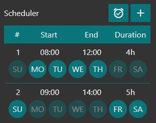
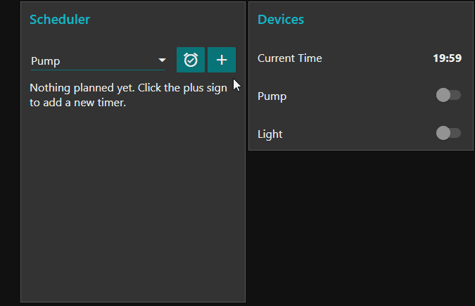

# node-red-contrib-ui-time-scheduler
A node-red-ui time scheduler for the Node-RED Dashboard.  

## Install
  
You can install this node directly from the "Manage Palette" menu in the Node-RED interface.  
Alternatively, run the following command in your Node-RED user directory - typically `~/.node-red` on Linux or `%HOMEPATH%\.nodered` on Windows

        npm install node-red-contrib-ui-time-scheduler
  
## Usage
  
Add a time-scheduler-node to your flow. Open the dashboard, you will see an empty scheduler.
Click the plus sign at the top right corner of the node to create a new schedule.
  
### Input & Output
  
Whenever you add or delete a schedule, the node sends a JSON string to its top output.  
You can use such a string to directly inject timers after a (re)boot or (re)deploy.  

Every other output (number of total outputs depends on how many devices you added) emits true/false every 60 seconds and also whenever you modify the current schedule. Adjusting the refresh rate and the number of devices is possible within the node's options.
  

  
### Frontend & Demo
  

## Examples
  
You can find example flows and schedules within the examples folder.  
Easily import flows via the Node-RED flow editor:  
☰ -> Import -> Examples -> node-red-contrib-ui-time-scheduler
  
## History
  
Find the changelog [here](CHANGELOG.md).
  
# Donate
  
You can donate by clicking the following link if you want to support this free project:
  

